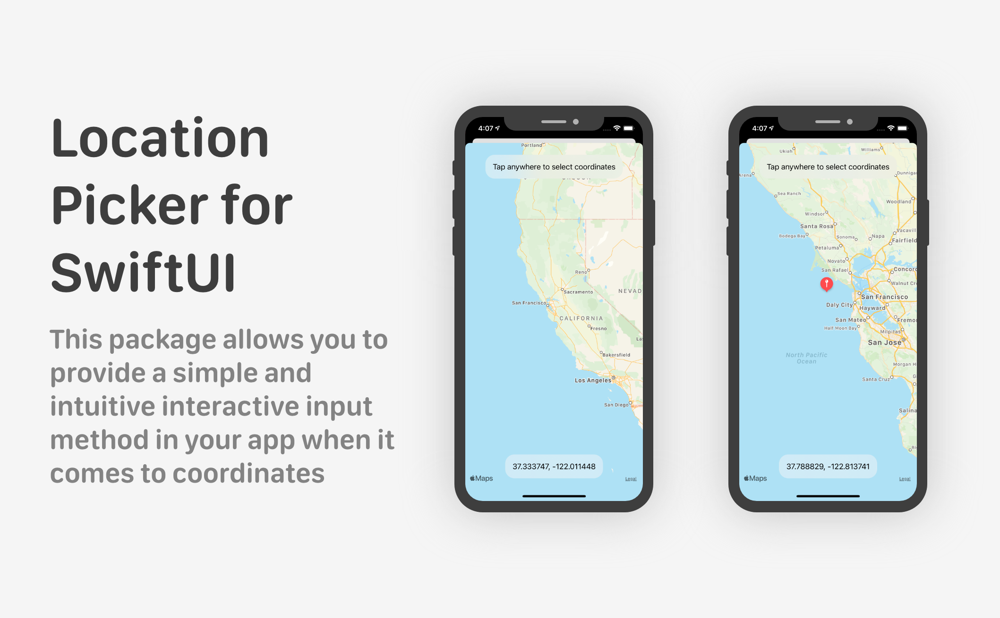

# LocationPicker for SwiftUI

`LocationPicker for SwiftUI` is a very simple and lightweight Swift package which provides you a SwiftUI view for interactive coordinates input!

First you need to create a view with a binding property of ``CLLocationCoordinate2D`` type (remember to import the MapKit framework!). This means that once the position is selected coordinates are directly passed to your previous view through the powerful binding system of SwiftUI without any additional effort. Now put the ``LocationPicker`` view into a Sheet or a NavigationLink passing the binding value previously mentioned.  
The user is now free to navigate around the map and select the location. Once pressed anywhere on the map, an annotation will appear on the map while coordinates are always displayed in real time at the bottom of the screen.
You can also provide a custom text to tell the user what to do.

<div align="center">
	
</div>


## Example

Here's a short usage example. You can find the full code in [UsageExample.swift](https://github.com/alessiorubicini/LocationPickerForSwiftUI/blob/master/Sources/LocationPicker/UsageExample.swift)

```swift
@State private var coordinates = CLLocationCoordinate2D(latitude: 37.333747, longitude: -122.011448)
@State private var showSheet = false

var body: some View {
    Button("Select location") {
        self.showSheet.toggle()
    }

    .sheet(isPresented: $showSheet) {
        NavigationView {
            
            // Just put the view into a sheet or navigation link
            LocationPicker(instructions: "Tap somewhere to select your coordinates", coordinates: $coordinates)
                
            // You can assign it some NavigationView modifiers
                .navigationTitle("Location Picker")
                .navigationBarTitleDisplayMode(.inline)
                .navigationBarItems(leading: Button(action: {
                    self.showSheet.toggle()
                }, label: {
                    Text("Close").foregroundColor(.red)
                }))
        }
    }
}
```

## Installation

Required:
- iOS 14.0 or above
- Xcode 12.0 or above

In Xcode go to `File -> Swift Packages -> Add Package Dependency` and paste in the repo's url: `https://github.com/alessiorubicini/LocationPickerForSwiftUI`.
Then choose the main branch (versions support coming soon).
